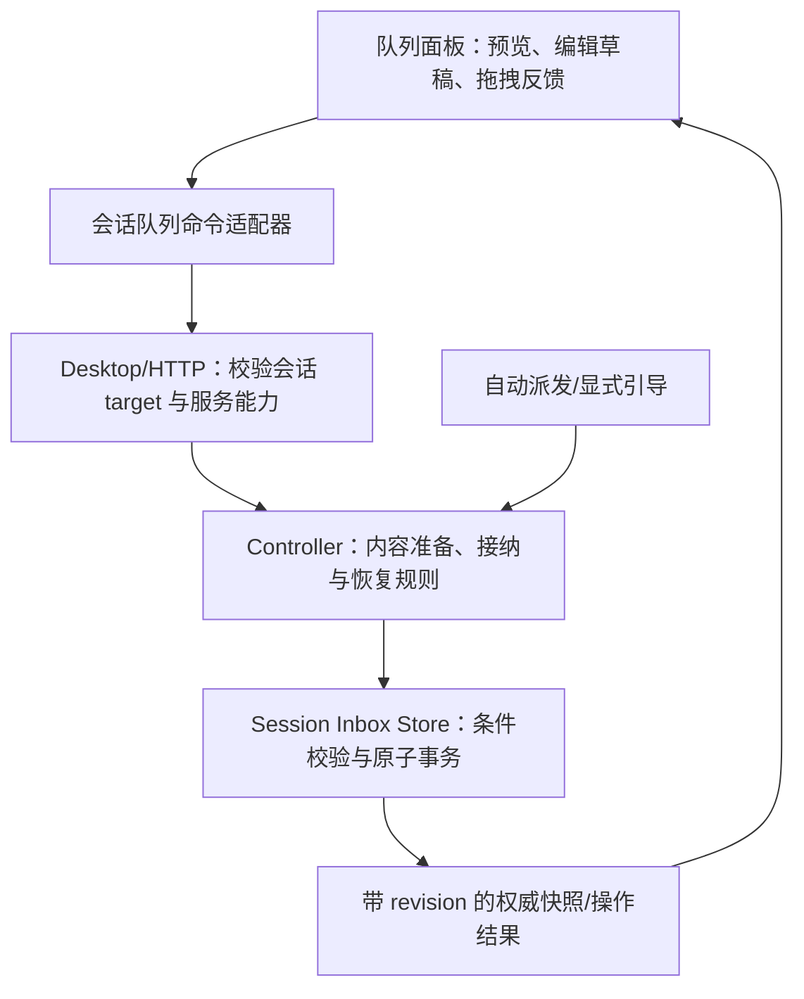
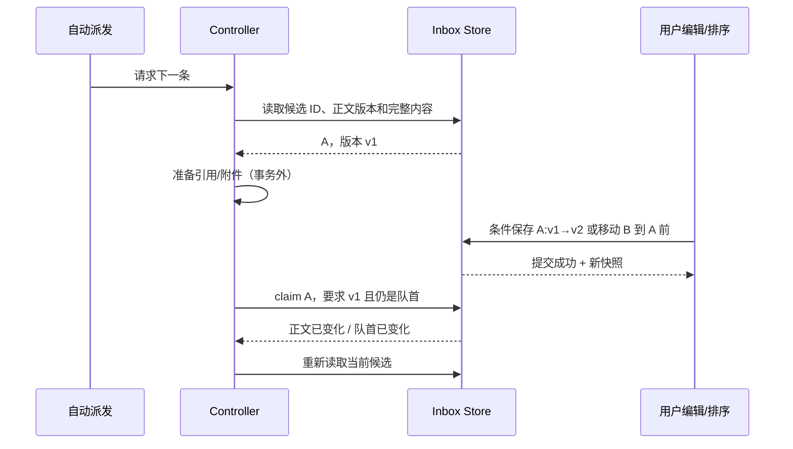

# 消息队列编辑与排序实施方案

日期：2026-09-21。状态：已按第二种交互实现；下文保留调研时的基线与方案，实施结果见[实现与验证记录](INBOX_QUEUE_IMPLEMENTATION.zh-CN.md)。

本方案同时处理两项用户反馈：待处理引导点击“保存引导修改”后提示“当前状态下无法操作这条收件箱指令”，以及希望调整消息队列的执行顺序。

## 1. 调研基线与证据范围

| 项目 | 本次检查的版本 | 范围 |
| --- | --- | --- |
| Reasonix 工作区 | `5c4b343a4ab08a91de649c49542291db056e7875` | 实施前的调研基线 |
| Reasonix 远端 main-v2 | `61cc393b2027391bc70742b1ce50531c3efd0b02` | 本次已 fetch；本文引用的队列组件、Controller、Store、队列适配器在两个提交间没有变化 |
| deepseek-harness 本地检出 | `ddefc45fbc7f8e46dd73185e68295696d1297887` | 读取本地实际实现，不声称是上游最新版本 |
| ZCode 本地检出 | `872ad960de7ec172591f7e1952f7849229f94521` | 读取本地实际实现，并执行了其工作区 freshness 检查 |

已核对源码和相关 GitHub Issue/PR；未连接用户截图中的运行实例，未取得该条目的 ID、实际版本和保存瞬间的 manifest。本方案区分源码中可直接确认的缺陷与需要确定性测试验证的时序风险，不把历史 Issue 的根因直接套用到本次截图。

历史关联：

- [Issue #8274](https://github.com/esengine/DeepSeek-Reasonix/issues/8274)：要求队列支持编辑；由已合并的 [PR #8701](https://github.com/esengine/DeepSeek-Reasonix/pull/8701) 实现。
- [Issue #8276](https://github.com/esengine/DeepSeek-Reasonix/issues/8276)：同一状态错误、引导条目卡死；[PR #8270](https://github.com/esengine/DeepSeek-Reasonix/pull/8270) 修复的是失去运行时所有者的中间态恢复问题。Issue 原文关于拒绝路径未回滚的推断被 PR 说明纠正，不能作为当前根因。
- [PR #8954](https://github.com/esengine/DeepSeek-Reasonix/pull/8954)：修复已执行消息残留、按条目 ID 对账、队列状态事件与取消回执。
- [Issue #8850](https://github.com/esengine/DeepSeek-Reasonix/issues/8850)：仍开放，涉及“加入队列”文案与立即引导行为不一致，以及切换会话时操作状态残留。

## 2. Reasonix 当前实现的具体问题

### 2.1 已确认的代码缺口

| 编号 | 代码事实 | 用户影响 | 依据 |
| --- | --- | --- | --- |
| F1 | 运行中提交通常尝试 steer；本地补齐收据时没有按 disposition 区分，可能把已接纳的条目标成 `queued` | 实际已不可编辑，界面却可能出现编辑入口 | [Composer.tsx](../desktop/frontend/src/components/Composer.tsx)，`queueOnly`、提交回执处理 |
| F2 | `canEdit` 仅控制进入编辑的按钮；进入编辑后，保存按钮和 Enter 不再检查条目状态、只读状态等 | 编辑期间状态改变后仍能发送必然被拒绝的保存请求 | [ComposerGuidanceShelf.tsx](../desktop/frontend/src/components/ComposerGuidanceShelf.tsx)，`saveEdit`、编辑分支 |
| F3 | 编辑初始值直接取 `submitText || text`；快照中的 `submitText` 为空，`text` 是最多 120 字符的预览 | 长消息可能只显示预览，保存后把完整正文截短；多行和富输入也可能失真 | [composerInboxQueue.ts](../desktop/frontend/src/lib/composerInboxQueue.ts)、[ComposerGuidanceShelf.tsx](../desktop/frontend/src/components/ComposerGuidanceShelf.tsx)、[types.go](../internal/sessioninbox/types.go) |
| F4 | 保存失败只弹 toast 并抛错，没有主动按后端结果刷新、分类恢复 | 用户留在无法保存的编辑框中反复点击 | [Composer.tsx](../desktop/frontend/src/components/Composer.tsx)，`editQueuedGuidance` |
| F5 | 前端禁止暂停、blocked、uncertain 条目进入编辑；空闲时非首项也受 `waitingForEarlier` 限制 | 不能在最适合整理的暂停状态编辑，不能提前改后面的消息 | [composerGuidance.ts](../desktop/frontend/src/lib/composerGuidance.ts)、[ComposerGuidanceShelf.tsx](../desktop/frontend/src/components/ComposerGuidanceShelf.tsx) |
| F6 | 后端已有 `MoveInboxItem(id, toIndex)`，CLI、HTTP、ACP 已使用；Desktop 没有排序入口 | 新需求主要缺少可靠的 Desktop 交互和跨端契约 | [inbox_app.go](../desktop/inbox_app.go)、[inbox_queue.go](../internal/cli/inbox_queue.go)、[inbox.go](../internal/serve/inbox.go) |
| F7 | 旧移动接口的下标属于完整 manifest；前端过滤 `running`、`steer_consumed` | 不能把可见列表下标直接传给旧 API，否则目标位置可能错误 | [ops.go](../internal/sessioninbox/ops.go)，`MoveItem`；[composerInboxQueue.ts](../desktop/frontend/src/lib/composerInboxQueue.ts) |
| F8 | 快照刷新会重复收起队列；编辑草稿属于 shelf 组件，缺少独立的会话和条目归属 | 整理被刷新打断；条目消失或组件卸载可能丢失未保存文字 | [useComposerInboxRefresh.ts](../desktop/frontend/src/lib/useComposerInboxRefresh.ts)、[ComposerGuidanceShelf.tsx](../desktop/frontend/src/components/ComposerGuidanceShelf.tsx) |

F1 的触发受收据、快照与消费事件的先后顺序影响；源码确有错误的状态构造，但尚不能证明截图一定走了这一顺序。

### 2.2 必须在实现前用测试固定的后端时序风险

1. **保存成功但执行旧正文。** `TrySubmitInboxItem` 先读 envelope、准备执行，再调用 `ClaimItem`；`UpdateInboxItem` 不使用同一 admission 锁，`ClaimItem` 也不核对刚才读取的正文版本。存在“读旧正文 → 编辑提交成功 → claim 成功 → 使用旧正文”的代码路径。`RunInboxTurn` 同样先读正文后 claim。
2. **排序成功但仍先执行旧队首。** 自动派发先 `NextQueued()` 选 ID，之后再 `TrySubmitInboxItem(id)`；两者之间可以发生移动，而 claim 没有核对当前队首。
3. **可见顺序不等于执行顺序。** `NextQueued()` 先遍历 followup，再遍历其余 queued 条目。单纯改 manifest 顺序仍可能被 intent 优先级覆盖。
4. **并发编辑覆盖。** Store 单次写入是原子的，但更新 API 没有客户端读取版本，不能识别两个窗口基于同一旧正文提交的不同改动。
5. **远程命令归属不完整。** 远程快照和入队已有专门路由、generation/selection 校验，读正文、编辑、移动等旧 Desktop 方法仍直接走 `inboxCtrl(tabID)`。新增交互必须完成远程适配或返回明确不支持，不能由快照可读推断命令也可用。

修复点应覆盖 Store 原子事务、Controller 派发以及各客户端适配；只增加前端禁用判断无法满足“保存后的内容确实被执行”和“排序后的顺序确实被执行”。

## 3. 两个参考项目的取舍

| 设计点 | deepseek-harness 实际实现 | ZCode 实际实现 | Reasonix 采用方式 |
| --- | --- | --- | --- |
| 排队与引导 | Inbox 分 `next-turn` / `next-step`；QueueDock 展示 `next-turn` | queue item 带 delivery、steer、dispatch 信息 | UI 明确区分“下一轮消息”和“已提交到当前轮的引导”，不把二者混成可编辑队列 |
| 权威状态 | `agent/inbox/spliced` 持久化事件生成投影 | CLI/runtime + CommandInbox 负责接纳，Renderer 维护临时操作覆盖层 | 复用 Reasonix Controller + 持久化 Store，不再引入另一套事件日志或第二个调度器 |
| 编辑 | 从完整 content 读取，按同一 ID 替换；仅允许纯文本编辑 | 当前 GUI 的编辑是“后端删除确认后撤回 composer”；另有原地编辑协议和 runtime 方法 | 保留 Reasonix 原地编辑、原 ID 和原位置；吸收 ZCode 的确认后生效、会话归属保护 |
| 排序 | 检查到的 `QueueAction` 只有 edit/remove/steer，没有排序入口 | 拖拽发送 `queueItemId + beforeQueueItemId`，null 表示队尾 | 采用 ID 锚点排序，并加上移、下移、置顶、置底及键盘操作 |
| 并发防护 | 精确定位仍待处理的消息，消费后不再可变更 | 命令串行接纳、revision 检查、reserved/promoting 行锁定 | 使用 Store 条件写入和 Controller admission 边界；不把 JSX 中的禁用当成最终裁决 |
| 失败处理 | 失败通知；条目离开队列会退出编辑 | ACK 区分 stale/noop 等，草稿恢复只作用于原会话 | 错误带当前状态和版本，保留编辑草稿，主动对账 |

不能直接照搬的细节：

- deepseek-harness 在条目消失时清掉编辑态，Reasonix 应保留未保存文字作为该会话的编辑草稿。
- ZCode 当前 GUI 撤回后再编辑会改变“仍在队列中”的事实；若照搬，会引入重新入队、原位置恢复及主输入框草稿冲突。本次选择原地编辑。
- ZCode 的排序在锚点消失时可退到队尾；Reasonix 应明确返回顺序冲突，避免把用户的“移到 B 前”悄悄改成“放到最后”。
- ZCode 使用整个会话 revision 做部分命令 CAS。Reasonix 排序使用 **Inbox revision**，编辑使用 **正文版本**，避免流式输出或其他条目改动让编辑频繁失效。
- 参考项目均不构成本次安装包行为或竞态安全性的测试证据。

## 4. 产品规则与交互

### 4.1 操作语义

推荐运行中主发送动作默认“加入队列”，显式“引导当前轮”在当前轮下一次可接纳边界生效。排队消息默认按顺序执行。立即引导保持现有不强制中断工具的语义，不照搬 ZCode 的 stop-then-send 行为。

这是相对当前普通运行中立即 steer 的产品行为调整，需与本功能一并说明。实施时为这两个动作建立单一提交路由，按钮文字、快捷键提示和实际 API 必须一致；如分批交付，第一批先修正真实状态及文字，切换默认动作与新队列面板在同一批上线。

队列显示在输入框上方：默认保持当前紧凑的两条预览；“展开队列”可查看全部。展开、编辑、拖拽状态不会被普通快照刷新收起。队列是最多 64 条的既有有界集合，不为排序引入额外的全量会话加载。

每行展示序号、正文预览、附件标记、状态，以及编辑、引导、更多操作。拖动只从独立拖拽手柄开始，不占用正文选择、输入框光标或整个行的点击。

已接纳到当前轮的条目显示为“等待当前轮接收”或“正在处理”，不纳入可排序的下一轮列表。已消费条目由权威快照移除，不再补回。

### 4.2 状态与操作矩阵

| 状态 | 编辑 | 排序 | 删除/撤回 | 派发规则 |
| --- | --- | --- | --- | --- |
| 入队请求尚未确认 | 否 | 否 | 保留原提交的取消规则 | 显示“正在加入队列”，不能伪装成 queued |
| queued，未暂停 | 是，任意位置 | 是 | 是 | 按权威顺序自动派发 |
| queued，队列已暂停 | 是 | 是 | 是 | 保存、移动不会自动恢复执行 |
| blocked | 是，可修复正文/引用 | 是 | 是 | 阻塞未解决时不派发；修复后仍遵守暂停状态 |
| uncertain | 是，显示恢复提示 | 是 | 是 | 编辑不代表确认重试；必须显式确认后才能重新派发 |
| steer_accepted | 否 | 否 | 若后端支持未消费撤回，使用专门 withdraw 能力及回执 | 不允许把已接纳项改回 queued 来绕过限制 |
| running / steer_consumed | 否 | 否 | 不再提供队列删除 | 执行状态与历史负责展示 |
| 只读 / 未知状态 / 服务不支持 | 否 | 否 | 否 | 给出具体原因，未知状态不能默认可编辑 |

队列暂停只暂停后续出队，不停止正在运行的任务。提供可见的“暂停队列 / 继续队列”，供用户长时间整理；进入编辑本身不隐式暂停整个会话，也不引入需要超时续租的编辑锁。

FIFO 规则明确为：所有仍在等待下一轮的条目按持久化顺序排列，不再通过 followup/steer 的隐藏优先级改变执行顺序。自动派发遇到队首 blocked/uncertain 时停在该条并提示处理；用户可以修复/确认、删除，或主动将它后移，再继续队列。恢复后不能悄悄越过未确认条目。

### 4.3 编辑流程

1. 点击编辑后捕获源会话 target，读取 **完整可编辑正文 + 正文版本 + 当前操作能力**；读取期间显示加载态，不能拿 preview 充当正文。
2. 使用多行编辑器，普通 Enter 换行，Ctrl/Cmd+Enter 保存，Esc 退出；中文输入法组合期间不触发保存。原有单行保存快捷键如需保留，也必须检查 `isComposing`。
3. 草稿键包含 host/workspace/session/generation/itemId，保存到现有草稿所有者；与主输入框草稿并存，不覆盖用户已经输入的下一条消息。
4. 保存只替换允许编辑的内容，保留 ID、队列位置、来源、附件和原入队幂等关系。纯文本完整保留换行和空白，trim 只用于判空，不无条件改写用户正文。
5. 带附件消息先支持“修改附带文字，附件保持原引用”；涉及结构化 skill/subagent 实体且无法可靠重建 offset 的条目，明确标记不支持此编辑方式，仍可排序和删除。不得静默降级为纯文本。
6. 保存发送时再检查当前能力，后端在提交事务内核对正文版本和实际状态。成功后使用返回的权威版本更新界面，再清除草稿；不重新入队、不移到队尾。
7. 如果派发先完成，保留草稿并显示“该消息已开始处理，本次修改未保存”，提供“保留为新消息草稿”。该动作只恢复草稿，不自动再次发送。
8. 如果另一个窗口先修改，显示“内容已在其他位置更新”，保留本地草稿，允许查看最新正文、复制自己的修改或重新基于最新版本编辑；不自动覆盖。
9. 如果仅发生其他条目的新增、编辑或排序，不使当前正文编辑失败。

### 4.4 排序流程

同一会话支持拖拽，以及更多菜单的“上移、下移、移到队首、移到队尾”。键盘可从手柄进入排序，方向键移动，Enter 确认，Esc 取消；另有可聚焦的上移/下移按钮，不能只提供鼠标拖拽。

客户端把所有交互统一转换为 `itemId + beforeItemId`，`beforeItemId: null` 明确表示尾部。首尾不合法动作禁用，同位置移动返回 unchanged。未提交本地回显和已经接纳的条目不参与排序。

拖动期间仅维护临时显示顺序，不修改权威队列。放下时提交一次请求；若期间收到队列结构变化，重新展示权威顺序并提示“队列已变化，请重新调整”，不猜测丢失锚点的位置。

同一会话最多一个排序写请求在途；只锁该会话的队列排序，不阻塞主输入框。响应只回到发起会话。拖到收起区域时先展开队列；使用面板内滚动，不通过排序操作驱动聊天正文滚动。

## 5. 状态所有者与接口



沿用现有 `Controller`、`sessioninbox.Store` 和 `InboxChanged`。前端队列只投影服务端事实；本地仅持有未确认提交、草稿和正在执行的 UI 操作。相同 ID 的权威条目始终覆盖本地回显，消费确认不能被晚到收据撤销。

### 5.1 新增受保护的接口，不破坏旧签名

建议新增 target 版本的读写接口（名称可按仓库生成器规范调整）：

- `ReadInboxQueueForTarget(target)`：返回完整元数据快照及操作能力。
- `ReadInboxItemForEdit(target, itemId)`：返回完整编辑正文、正文版本及附件/结构化内容描述。
- `MutateInboxItemForTarget(target, request)`：edit、move、delete 等队列变更的受保护入口。显式 steer 继续复用既有 exact-turn 接纳路径，并返回一致的状态结果。

`target` 复用并完善 `InboxTargetView` 的 sessionPath、generation、selection、remote、host/workspace 语义；不能只传可被重新绑定的 tabId。每个异步回包还绑定客户端源草稿键。

示意协议：

```ts
type QueueMutation =
  | { kind: "edit"; operationId: string; itemId: string;
      expectedContentVersion: string; text: string }
  | { kind: "move"; operationId: string; itemId: string;
      beforeItemId: string | null; expectedQueueRevision: number }
  | { kind: "delete"; operationId: string; itemId: string };

type QueueMutationResult =
  | { operationId: string; sessionPath: string; queueRevision: number;
      outcome: "applied" | "unchanged" | "conflict";
      reason?: "content_changed" | "order_changed" | "anchor_missing";
      snapshot: QueueSnapshot } // 有界元数据，不携带所有消息正文
  | { operationId: string; outcome: "unavailable";
      reason: "item_not_pending" | "item_missing" | "session_changed"
        | "read_only" | "unsupported";
      snapshot?: QueueSnapshot }; // 只能携带仍属于原 target 的快照
```

协议在 Go 与前端都使用对应的明确类型。数据解析错误、磁盘写入失败等仍走真正的错误通道；可以预期的状态冲突返回结构化结果，不靠匹配中文/英文错误字符串。

快照增加只读的 `contentVersion`、`allowedActions`、`disabledReason`。Controller 根据元数据状态、只读与服务能力产生这些字段；完整内容的类型和编辑方式由 `ReadInboxItemForEdit` 返回，不为判断编辑能力加载所有正文。UI 能力只是当时的事实，后端每次提交仍重新校验。target 已失效或服务不支持时可以没有快照，不能返回新绑定会话的快照作为替代。

### 5.2 版本与重试

- 正文版本由现有 immutable blob 身份与 checksum 派生为不透明 token，不直接把磁盘路径交给前端。现有 item `Revision` 并非所有状态变更都更新，不把它误用成万能版本号。
- 编辑比较正文版本，状态在事务内另行检查；移动比较 Inbox 的 revision，避免与会话 streaming revision 耦合。
- `operationId` 用于响应归属和诊断；不宣称它自动提供持久化幂等。此次不建立全局命令系统或第二份业务队列。
- 超时后首先读取原会话的权威状态；正文与待保存内容一致时可以说明当前内容已一致，但不能据此证明原请求的执行历史。
- 若响应丢失且条目已经执行/消失，状态显示“保存结果未确认”，保留草稿；不自动重发，不声称已经成功，也不自动创建替代消息。
- CAS 能保证同一旧版本不会被重复覆盖。过期响应只能结束自己的操作，不能撤销更晚的快照或清除后续草稿。

## 6. 后端原子性与实际执行顺序

### 6.1 条件编辑

新增受保护的 Store 更新原语：在既有进程锁与磁盘事务内重新读取当前 manifest，校验存在性、可变状态和 `expectedContentVersion`，然后提交新 immutable blob 与 manifest 指针。

Controller 在事务外准备引用和附件；提交时再比较最初读取的版本。所有需要连动的字段——正文、预览、checksum、引用摘要、blockReason、必要的 pause 状态——一次事务提交。准备引用失败或版本变化不能先保存一半，再改状态。

完整保留原有 envelope 中未被编辑的附件、授权事实、structured invocation、source、Extra、格式和入队指纹/幂等关联。不要用只含 display/raw/submit 的新结构覆盖其余事实。引用变更的重解析使用既有安全路径；未变化的附件不重新上传，也不重新获取权限。

### 6.2 锚点排序

新增 `MoveItemBefore` 条件事务：

1. 刷新 manifest 并核对 `expectedQueueRevision`。
2. 校验源条目和目标锚点属于同一收件箱、仍可排序；缺失锚点返回冲突。
3. 从待处理条目序列中移除源 ID，再插入锚点之前或尾部。
4. 将该序列映射回原 manifest 的待处理位置，保持非待处理条目及其状态不变。
5. 一次提交新顺序并增加 revision；不读写正文 blob、不改变条目 ID 或幂等键。

旧 `MoveInboxItem(id, toIndex)` 保留原有数值位置语义，内部下标解析与移动必须在一个事务内完成。新 Desktop 不使用这个下标 API。CLI/ACP/HTTP 的新调用逐步使用锚点/版本参数，兼容旧客户端。

### 6.3 派发必须核对“准备的正文”和“最新队首”

不要只给 `UpdateInboxItem` 加一把锁。自动选队首、正文准备和最终 claim 之间仍存在多阶段窗口，而且磁盘可以被其他进程更新。

将 Store claim 扩展为带条件的接纳：`itemId + expectedContentVersion + dispatchPolicy`。自动派发策略要求在同一磁盘事务内确认它仍是当前可派发队首；用户显式选择的引导由单独明确的动作语义处理。



必须满足：

- 编辑先提交，执行器只能取得新正文；claim 先提交，编辑得到 not-pending 并保留草稿。
- 排序先提交，下一次自动 claim 使用新队首；旧队首先被 claim，则排序不能再移动该条目。
- `RunInboxTurn`、自动 dispatcher、显式 steer，以及引用失败转 blocked 的路径都核对其准备时读取的正文版本。
- stale candidate 是重新选择工作的信号，不是磁盘故障；由现有 level-triggered dispatcher 再调度，不使用加长超时或忙循环掩盖。
- 显式引导的 accepted 状态也通过“期望正文版本 + pending 状态”原子转换；消费 loader 只接收已接纳的那一版正文。
- 复用现有 owner 跟踪与 orphan 恢复。只有后端证明失去 owner 才恢复 uncertain，前端不得自行把 in-flight 条目回滚为 queued。

文件冻结、附件读取和网络调用不放在磁盘锁或 App 全局锁内。维持既有 admission、scan、runtime publication 的锁序；需要回调 App 的派发必须避免锁重入。

## 7. 前端组织与跨端一致性

将队列逻辑从超大的 Composer 中收敛为可测试的独立模块：

| 位置（建议） | 职责 |
| --- | --- |
| `lib/useComposerInboxQueue.ts` | 权威快照、revision 门禁、事件刷新、会话归属；整合现有 refresh 逻辑 |
| `lib/inboxQueueCommands.ts` | 受保护的读写接口、错误分类、响应归属；不持有第二份业务队列 |
| `lib/inboxQueueDrafts.ts` | 按会话和 item ID 保存未提交编辑，复用现有草稿存储策略 |
| `components/ComposerGuidanceShelf.tsx` 或更名后的 QueuePanel | 列表、状态、暂停/恢复和展开；保留兼容样式入口 |
| `components/InboxQueueItem.tsx`、`InboxQueueEditor.tsx` | 行操作、多行编辑和明确的冲突提示 |
| `lib/inboxQueueOrder.ts` | 从拖拽/按钮得到 ID 锚点的纯函数，测试上下移动与首尾边界 |

Reasonix 当前 frontend 没有安装 ZCode 使用的 dnd-kit。实施拖拽时采用维护中的排序库并验证 React 19、键盘和触控支持；放在队列的 lazy chunk 内，记录依赖及打包体积。具体版本在实现时核验，不按另一个项目的 lockfile 直接搬运。

提交回执按真实 disposition 对账：`steer_accepted` 是处理中，`queued_followup` 才能成为普通待处理条目；未知 disposition 保留确认中状态并刷新。发送、保存、删除、拖拽不再共享一个可能跨会话残留的全局 busy 标识。

快照只接受同一会话且 revision 不倒退的结果。加载空预览或完整编辑正文的异步回调也必须带读取版本和会话 generation，防止后到的旧 hydration 覆盖新顺序、新正文或另一个会话。

远程链路新增明确的 `inbox-mutations-v1` 能力协商，名称以最终协议登记为准。新客户端 + 新远程服务提供完整编辑/排序；旧远程服务显示可阅读的队列与“需要更新远程服务”的具体原因。禁止将远程写请求回退到本地 Controller。入队、取消、引导、暂停等兄弟路径同样检查 source target。

诊断记录 operationId、会话归属标识、itemId、动作、期望/实际 revision、状态与裁决原因，并统计保存冲突、排序冲突及重新选择队首次数。日志不保存用户正文或附件内容。反馈中应能区分“原请求已提交”“状态冲突”“结果尚未确认”，便于下一次从实际条目定位问题。

## 8. 兼容、持久化与缓存

| 变更 | 兼容策略 | 验证 |
| --- | --- | --- |
| 队列顺序 | 使用既有 manifest.Items 顺序，无额外 rank/index 文件 | 新顺序关闭后重开仍一致，旧读取器能读 |
| 正文版本 | 从已有 blob/checksum 派生，不增加必需持久化字段 | 旧单 blob 格式和新 immutable blob 均生成有效 token |
| Desktop/HTTP 参数 | 增量新增 target/条件写入方法，旧签名保留 | 生成契约、旧调用及空数组序列化测试 |
| 正文与富输入 | 保存未编辑的 envelope 信息，沿用既有格式 | 附件、引用、invocation、幂等指纹往返测试 |
| 默认 busy 输入行为 | 新 UI 默认加入队列，显式引导入口清晰可见 | 发布说明及快捷键文案同步，已持久化消息不被批量改写 |
| FIFO/暂停恢复 | 不添加新的持久化状态枚举；明确 blocked/uncertain 队首行为 | 旧队列恢复、新版派发、暂停状态保留 |

新运行时保证条件编辑与原子 claim；旧运行时仍可能遵循旧的并发与排序逻辑，不能用“文件格式可读”宣称混用旧运行时也有新保证。实现时核对现有 session owner/lease 对跨版本写入的约束，避免两个运行时同时控制同一会话。

队列 UI、顺序元数据、版本号和错误状态不写入系统提示词或工具 schema。实际执行时使用用户确认的正文和顺序，继续沿用既有 provider 输入路径。新编辑内容只影响相应未来用户输入，不重写已经发送的历史；实施后运行相关 cache guard 验证稳定前缀未变化。

## 9. 验收与测试矩阵

所有竞态使用 channel/hook/deferred promise 固定先后顺序；`go test -race` 是补充检查。测试夹具使用临时会话与目录，不接触用户原始队列。

| 场景 | 必须验证的结果 |
| --- | --- |
| 普通短文本修改 | 同 ID、同位置，保存后执行新正文 |
| 超过 120 字、多行、空白与中文 IME | 加载完整正文，不截断、不意外提交、不无条件 trim 正文 |
| 队列非首项 / 暂停状态编辑 | 可编辑、可保存；不会触发恢复或抢跑 |
| 编辑 A 时新增/移动 B | A 的正文版本仍有效，不因无关变化失败 |
| 两个窗口修改同一项 | 一方提交，另一方收到冲突并保留草稿 |
| 保存先于 claim / claim 先于保存 | 新正文被执行 / 保存明确失败且草稿保留，不能成功后执行旧正文 |
| 进入编辑后变成 accepted/consumed/removed | UI 能力更新；编辑文字可恢复，不把消息补回待处理列表 |
| 已接纳收据晚于快照/消费事件 | 不把 accepted 强行设为 queued，不复活已消费条目 |
| 头→尾、尾→头、相邻移动、同位移动 | 结果顺序正确，ID 集合、正文和附件不变 |
| 有 running/consumed 条目的完整 manifest | 可见队列排序与后端结果一致，不受过滤下标影响 |
| 重排先于 claim / claim 先于重排 | 执行新队首 / 不移动已接管项，刷新后再操作 |
| 拖拽时源或锚点被消费/删除 | 明确冲突；不静默放到队尾、不丢项 |
| followup 与旧 queued steer 混排 | 界面顺序与实际下一轮执行顺序一致 |
| blocked/uncertain 在队首 | 停止自动派发并给恢复入口；编辑不等于重试确认 |
| 保存或移动后进程重启 | 内容与顺序持久化；未确认条目按既有恢复策略暂停 |
| 磁盘写失败/写入中断 | 旧完整版本或新完整版本，不能正文与 checksum/顺序分裂 |
| 附件、文件引用、structured invocation | 未编辑信息与幂等身份不变；不支持的编辑明确禁用 |
| 保存/排序期间切会话、重绑 tab 或重连 | 回包只属于源会话，不覆盖新会话草稿或顺序 |
| 远程新旧能力组合 | 支持则真实远程执行；不支持则明确显示，无本地误写 |
| 请求结果不明 | 先读状态，不盲重试、不伪造成功、不重复创建消息 |
| 鼠标、键盘、触控排序 | 均可完成；保留焦点、读屏位置播报和文本选择 |
| 多次快照刷新、长队列展开 | 编辑/展开不被打断，不产生聊天正文滚动 |

执行层次：

1. Store / Controller：补充条件编辑、锚点移动、原子 claim 的确定性测试，再运行 `go test ./internal/sessioninbox ./internal/control` 及受影响路径的 race 测试。
2. 兄弟入口：HTTP、CLI、ACP、Bot 对新增契约和原调用的回归；Desktop Go 从 `desktop/` 模块执行相应测试，不能由根目录 Go 测试替代。
3. 前端：扩展 `composer-inbox-interleaving.test.tsx`、`composer-inbox-recovery.test.tsx` 并新增编辑与重排测试；运行相关 tsx 用例、typecheck、test:typecheck、hooks lint 与 build。
4. 真实浏览器：新增队列浏览器用例，覆盖拖拽、键盘、多行正文、会话切换、暂停恢复和事件先后顺序。发现并使用实际 dev-server URL。
5. Desktop 安装包：Windows、macOS 记录截图问题的重现与修复对比；验证原生拖动区域不会吞掉队列手柄操作。Linux 至少由对应 CI 与可用的平台 smoke 覆盖。
6. 若后续授权 PR：推送后重新读取该 SHA 的 CI；已合并不等于已发布，已发布不等于用户安装版本已验证。

## 10. 实施拆分与完成门槛

| 阶段 | 主要工作 | 可交付与门槛 |
| --- | --- | --- |
| P0：复现与协议定稿 | 将 F1–F8 和后端 interleaving 写成失败用例；确定状态矩阵、正文与排序版本、兼容接口 | 失败机制可重复，输入/结果契约可审查；取得原反馈版本后补对照记录 |
| P1：权威变更与接纳 | Store 条件编辑、ID 锚点移动、含正文版本与队首校验的 claim；覆盖自动/同步/steer 路径 | 保存与排序结果能被实际执行证明；保持原子持久化与既有 owner 规则 |
| P2：接口与远程 | target 读写、结构化结果、能力协商、旧接口适配及生成契约 | 本地/远程会话归属一致，旧服务可明确降级，兄弟客户端无回归 |
| P3：完整队列体验 | 完整正文编辑、草稿恢复、显式 queue/steer、暂停管理、拖拽和键盘排序、状态对账 | 用户从编辑到保存、从排序到执行都能完成；不再依靠 generic toast 结束流程 |
| P4：系统验收与交付 | 确定性并发、重启恢复、浏览器与原生安装包验证、文档与发布说明 | 测试矩阵完成，真实版本问题可对照；记录未具备的平台或安装包证据 |

P1/P2 可以拆为相邻的小 PR，但编辑 UI 与排序 UI 都必须建立在共同的条件变更契约上。不能以“界面能拖动”或“保存不再弹 toast”作为整体完成。

最终完成标准：用户能够修改任意尚未执行消息的完整正文、调整其顺序，且下一次真实执行使用保存后的正文与确认后的顺序；条目在操作中被接管、被其他窗口修改或服务断线时，界面给出准确状态并保留用户文字。暂停、重启和切换会话后仍满足相同规则。

## 11. 参考源码入口

以下参考路径指向本次调研的本地检出，便于实施时核对；参考项目不需要跟随 Reasonix 改动。

- deepseek-harness `packages/client/ui-conversation/src/client/queue/QueueDock.tsx`：next-turn 投影、完整文本、发送中回显、编辑生命周期。
- deepseek-harness `packages/api/session-controller/src/types.ts` 中的 `QueueAction` 与 `commands.ts` 中的 `updateQueue`：明确动作契约、精确条目定位。
- deepseek-harness `packages/core/agent-loop/src/inbox.ts` 中的 `ReactLoopInbox`：claim、replace、持久化 splice。
- deepseek-harness `apps/web/tests/queue-actions.e2e.ts`：编辑、移除及停止时的队列保留测试设计。
- ZCode `packages/ui/src/v4/ConversationQueuePanel.tsx`：ID 锚点排序、拖拽手柄、行 dispatch 锁定。
- ZCode `packages/ui/src/v4/SessionPane.tsx`：撤回编辑的 ACK、草稿冲突与源会话校验；以及 reorder 命令构造。
- ZCode `apps/zcode-cli/packages/bootstrap/src/zcode-protocol-v4/command-inbox.ts`：会话命令接纳、revision 校验、重复命令结果。
- ZCode `apps/zcode-cli/packages/core/src/runtime/methods/steering.ts`：原地正文更新、顺序持久化和 projection 一致性。
