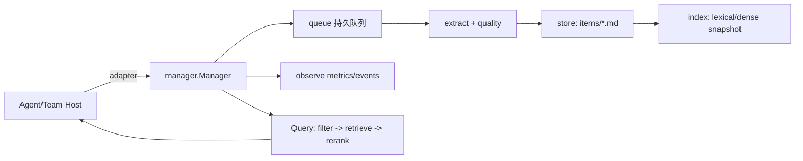
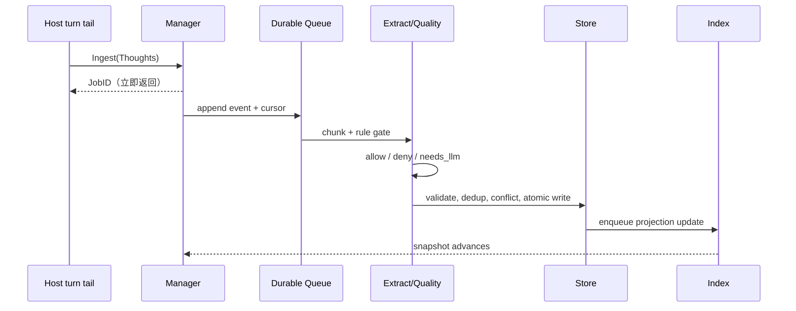

# 团队知识库组件设计报告

> 版本：合并设计真源（P0/P1 已实现并终审 PASS；P2 计划待排；P3 SQLite/FTS 契约冻结 deferred，见 §12 / §14.1）  
> 核心代码归属：`internal/knowledge_base/`  
> 运行期数据目录：`team/knowledge_base/<team-id>/`（每个团队独立子目录，运行数据应由 `.gitignore` 排除）

## 1. 目标与边界

知识库把成员在回合结束时产生的决策、事实、约束、经验和纠错记录，异步整理为可追溯的 `KnowledgeItem`。写入不能阻塞 Agent 主流程；查询必须同时支持语义检索、关键词/元数据过滤，并保证团队隔离。

MVP 假设：单进程每团队一个 `Manager`、单写队列；索引是可重建的最终一致读模型；采集点位于 turn tail，不修改当前回合的 cache-stable 系统提示前缀；LLM 仅在规则无法处理且有配额时调用，失败自动降级为规则路径。

非目标：跨团队共享、完整 transcript/黑板替代、跨进程分布式写入、在线训练 embedding、自动无审计硬删除。

## 2. 整体架构

### 2.1 模块与职责

核心包只依赖标准库和抽象接口，不 import `agent`、`cli`、`control` 或前端包：

| 模块 | 职责 |
| --- | --- |
| `model` | Thought、Chunk、KnowledgeItem、Scope、事件和枚举校验 |
| `extract` | 确定性分块、规则抽取、可插拔 LLM 抽取 |
| `quality` | 质量门、去重、冲突与版本链 |
| `store` | 文件/frontmatter 真源，原子写、CAS、读取和归档 |
| `queue` | 持久化任务、重试、游标和崩溃恢复 |
| `index` | 词法倒排/向量索引、过滤投影、快照和重排 |
| `manager` | 对外门面，编排 ingest/query/生命周期和 worker 池 |
| `adapter` | 宿主提供 Thought、团队范围、时钟、配额和事件 Sink 的窄接口 |
| `observe` | 事件计数、延迟/积压指标和告警，不参与策略决策 |



### 2.2 数据布局

```text
team/knowledge_base/
├── <team-id>/                        # 运行期数据，按团队隔离（.gitignore 排除）
│   ├── items/<item-id>.md             # 真源：frontmatter + Markdown 正文
│   ├── index/                         # 可删除、可重建的读模型
│   ├── queue/events.log               # append-only 任务日志
│   ├── queue/cursor                   # 已确认位点
│   └── .schema-version
└── README.md
```

团队 ID 必须符合 `^[A-Za-z0-9_-]{1,64}$`；禁止绝对路径、`.`、`..` 和分隔符。部署到其他状态根时通过 `DataRoot` 配置覆盖，但仍保持 `<DataRoot>/<team-id>/` 的隔离形态。

## 3. 数据模型与分块

### 3.1 Thought、Chunk、KnowledgeItem

```go
type Thought struct {
    ID string             // ULID，全库唯一
    TeamID, AgentID string
    SessionID, TurnID string
    Kind ThoughtKind      // decision/action/observation/correction/conclusion/user_request
    Text string            // 采集上限 4 KiB，超长先切分
    Provenance []Ref       // 会话、文件、工具结果或外部引用
    CreatedAt time.Time
    ContentHash string     // 归一化文本哈希
}

type SourceChunk struct {
    ID string              // 内容+顺序的稳定哈希
    SpanRefs []string      // Thought 或文档段落定位
    Text string
    Order int
    SourceType string      // thought_stream/document/diff
    TokenHint int
}

type KnowledgeItem struct {
    ID, Canonical, Title string
    Kind ItemKind          // fact/decision/constraint/convention/howto/location/warning
    Scope Scope             // team/project/agent/global（MVP 默认 team）
    Tags []string
    Provenance []Ref
    Quality QualitySignal
    Version int
    Status Status           // draft/live/superseded/deprecated/retired
    CreatedAt, UpdatedAt time.Time
    Body string             // 规范化 Markdown，≤8 KiB
}

type QualitySignal struct {
    Confidence float64       // [0,1]
    ReviewLevel string        // none/peer/leader
    Checks []string
    Suspect bool
}

type Ref struct { Kind, Target, Anchor string }
```

强校验：枚举封闭；`Title <= 120` 字符、`Body <= 8 KiB`；至少一条非空 Provenance；Canonical 规范化后同键最多一个 `live`；ID 不复用，修改采用新版本并链接旧版本。

### 3.2 Chunking 策略

按 turn、工具调用、标题/空行等自然边界切分，并尽量把“理由 + 行动 + 结果”放在同一块。目标 512–2048 token，硬上限 4096 token；低于下限的相邻块合并，超限块显式计为 `drop:oversize`。MVP 不重叠，每个 Thought 恰好属于一个 Chunk；相同输入序列必须产生字节稳定、可幂等重放的 Chunk ID。

## 4. 知识提取、质量与冲突



1. 规则层优先识别可验证命令结果、显式决策、路径/约束等，直接生成高置信条目；不满足模板的候选拒绝。
2. `needs_llm` 才进入 LLM；要求结构化 schema、temperature 0、调用和 token 配额、可 mock。输出无法解析或无法由 Provenance 锚定时 fail-closed 丢弃。
3. 去重按成本递增：ContentHash 精确合并；Canonical 相同进入版本/冲突裁决；近义 embedding 合并仅作为 post-MVP `merge_candidate`。
4. 质量门检查长度、可行动断言、出处、锚定、scope 和占位/乱码。低置信 `constraint/warning` 只能 `draft`，不进入 live 查询。
5. 冲突规则：同源同 Canonical 版本递增并 supersede；不同 Agent 的 live 冲突保留两条并标记 `pending_conflict`，交由 leader/人工裁决；规则产物优先于 LLM。禁止原地覆盖和孤儿 superseded。

## 5. 存储方案与团队隔离

| 方案 | 优点 | 缺点 | 结论 |
| --- | --- | --- | --- |
| 文件 + frontmatter | 零新增依赖、可读可审计、原子 rename、易备份 | 跨文件无事务、目录扫描成本 | **MVP 推荐** |
| SQLite（modernc） | 事务、SQL/FTS、规模增长稳定 | 正文可读性差、需迁移、与文件真源双轨 | >5k 条目或需要事务时升级 |
| 内存索引 | 查询快、实现简单 | 重启丢失、冷启动重建慢 | 仅作缓存/读模型 |
| Milvus/Pinecone 等 | 大规模向量检索、托管扩展 | 网络/成本/租户和供应链复杂 | post-MVP 可插拔后端 |
| Elasticsearch/OpenSearch | 全文、过滤、向量一体 | 运维重、资源和版本成本高 | 大规模部署再评估 |

MVP 使用 `fileutil.AtomicWriteFile`/`ClaimRename` 和 frontmatter 解析器。`items/` 是唯一真源；`index/` 和队列可删除后重建。Manager 在构造时绑定单一 team，所有 Query 强制 team + scope 过滤，ClearTeam 先将目录移至 `.trash/<timestamp>-<team-id>` 再使其退出查询面。

## 6. 检索机制

### 6.1 混合检索流水线

```text
Query -> 硬过滤(team, scope, status=live, TTL, ACL)
      -> lexical BM25/倒排 top-K_l
      -> dense ANN top-K_v（embedding 后端启用时）
      -> 融合 RRF: score = Σ 1/(k + rank_i)
      -> 规则重排（质量、时效、review、来源权重）
      -> 懒加载正文并返回 Result
```

MVP 没有 embedding 时只启用 BM25 类词法检索和 trigram/关键词精确匹配；可换后端接缝 = `index.ReadModel`（§12 P3 冻结，后续可叠加 dense），**不抽 store、无 `Retriever`/`Reranker` 门面**。元数据过滤在召回前执行，禁止依赖召回后过滤弥补越权。默认 `K<=20`，宿主按配额调整。**检索失败降级已实现**：`manager.Query` 在 `index.Search` 或分词失败时降级为 store 全量 live 扫描、按 `UpdatedAt` 倒序、截断到 `EffectiveLimit`（manager/query.go `queryByUpdated`），降级结果不带 Score/Fields/Snippet；读模型故障绝不使查询失败，store 真源读失败仍回抛。

### 6.2 重排与结果

规则分数可采用 `0.45*text + 0.2*quality + 0.2*recency + 0.15*review`，权重配置化。返回 item ID、标题、来源、命中字段和分数摘要；正文只加载命中的 top-K。查询只读索引快照，不锁写队列，也不在回合中途修改系统提示前缀。

## 7. 成员生命周期同步

宿主监听 `member_added/member_retired/member_deleted`，转换为 `Manager` 已有的 `Retire`/`ClearTeam` 操作，避免把团队事件模型泄漏到核心。新增成员时从宿主历史轨迹按游标回放 Thought，走同一幂等 Ingest 流程；历史导入批次带 `source=backfill` 标签。

成员暂离采用软删除：tombstone 状态 `live -> retired` 单向迁移（状态枚举以 model 为准，无 `active`），默认保留知识并标注原作者，查询排除 retired。永久删除先导出审计摘要，再异步物理清理；所有删除原因使用白名单，非法原因 fail-closed。事件审计按单调 seq 追加，重复事件幂等。

## 8. 增量队列、索引与维护

- Ingest、Retire、ClearTeam 均写入 append-only 队列并立即持久化游标；消费语义 at-least-once，消费者以 JobID/ItemID 幂等。
- 顺序固定为“真源 item 原子提交 -> 索引投影更新 -> 确认游标”，索引永不超前于 store。
- 重试采用指数退避和最大次数；达到上限进入 `dead-letter`/`ingest_failed`，不无限堆积。
- 定期比较 store 与 index 计数和游标；漂移超阈值触发全量重建。索引目录可整体删除后从 items 重建。
- 背压水位触发合批、降低 LLM 调用或暂停低优先级 Ingest；`Backlog()` 可观测。

## 9. 与现有系统的集成 API

```go
type Host interface {
    Clock() time.Time
    ScopeOf(Thought) Scope
    Quota() Quota
}
type Sink interface { Emit(Event) }
type Adapter interface { Host; Sink }

func New(Adapter, ...Option) (*Manager, error)
func (m *Manager) Ingest(context.Context, []Thought) (JobID, error)
func (m *Manager) Query(context.Context, Query) ([]Result, error)
func (m *Manager) Retire(context.Context, []ItemID, RetireReason) error
func (m *Manager) ClearTeam(context.Context, string, Scope) error
func (m *Manager) Backlog(context.Context) (int, error)
func (m *Manager) Close() error
```

宿主在 turn tail 回调中构造 Thought 并调用 `Ingest`，只等待入队确认；下一回合或下次 boot 才调用 `Query`，将结果格式化为 tail。Adapter 接线已落地：`internal/boot` 的 `KBHost` 实现 adapter 并带 `var _ adapter.Adapter = (*KBHost)(nil)` 编译断言；cli 宿主的采集/查询/关闭调用点见 §14.1 F7。

建议配置：`DataRoot`、`TeamID`、worker 数、队列容量/重试、chunk 窗口、LLM provider/model/日预算、embedding 开关、top-K、TTL、保留期和指标阈值。

## 10. 可观测性

事件：`item_committed`、`index_caught_up`、`retired`、`quality_downgraded`、`ingest_failed`、`backlog_high`、`rebuilt`。指标至少包括队列积压、cursor gap、index drift、worker fail rate、LLM 降级比例、Query p95 延迟和命中率。observe 只聚合，不同步写监控 IO；重复 seq 事件幂等折叠。告警必须有恢复去重，异常只报告，不在核心内自动重启。

## 11. 风险与缓解

| 风险 | 缓解 |
| --- | --- |
| 热路径被抽取/IO 阻塞 | turn tail 入队即返；有界 worker；前缀稳定性测试 |
| LLM 成本或供应商故障 | 规则优先、预算/速率限制、批处理、可 mock、降级计数 |
| 队列或索引失控 | 持久游标、at-least-once 幂等、背压、漂移重建、dead-letter |
| 数据串团队/路径穿越 | Manager 绑定 team、ID allowlist、每层 scope 过滤、confined IO |
| 幻觉和低质量知识 | Provenance 强制、锚定检查、质量门、低置信 draft、人工冲突裁决 |
| 敏感信息泄漏 | secret/PII 规则过滤、最小权限、0600 文件权限、审计与保留期 |
| 条目膨胀与查询退化 | TTL/retired、top-K、分层索引；量化触发阈值（live ≥ 5000 或 Query/List p95 超阈，见 §12 P3）触发 SQLite/FTS 评估 |
| 并发覆盖/崩溃半写 | 单写队列、CAS、原子 rename、重启游标续跑 |

## 12. 分阶段实施计划

### P0：本地 MVP 管道

实现 `model`、文件 store、单写持久队列、规则抽取、最小词法索引、`Manager.Ingest/Query` 和 Adapter 装配。退出条件：黄金路径写后可查、并发 Ingest 无丢失/双写、Query 只见已提交、路径隔离和前缀稳定测试通过。

### P1：生命周期与健壮性

加入 Retire/ClearTeam、历史 backfill、tombstone/审计链、重试/背压/dead-letter、索引漂移巡检和重建。退出条件：成员增删幂等、软删不可检索、kill/restart 不重不丢、积压有界。

### P2：可观测与质量增强

补齐事件/指标/告警去重、TTL/GC、近义候选、可配置阈值和质量仪表盘。退出条件：指标单调、p95 可测、异常恢复不刷屏、长期运行条目数可控。

### P3：规模化可选升级（SQLite/FTS）—— 契约已冻结，本轮 deferred

> 状态：完整 SQLite/FTS **本轮 deferred**；默认 = 文件真源 + 内存索引（P0/P1 已 PASS），零行为变化、无静默自动切换。以下为 architect 冻结的 P3 契约，是未来落地唯一依据（先共享对齐再编码）。同时收敛答复 reviewer B1–B4 与 tester C1–C5。

**量化触发阈值（评估 SQLite/FTS 的条件，非自动切换）**：满足其一即评估
- 规模：live 条目 ≥ `SuggestSQLiteLiveItems = 5000`（对齐"约 5k"；P3 落地时以该 const 进 core，未落地前不新增）；
- 延迟：持续 Query p95 > 200ms，或全量 store 扫描（`store.List`，即退化/重建路径）p95 > 100ms（沿用 §10 Query p95 指标，连续观测窗稳定超阈）。

数值为架构默认、宿主可配置；仅供装配决策，core 永不据此自动切后端。

**接缝（B1/C1 裁决）—— 只抽读模型接口，不抽 store**：
- `store.Store` 保持**具体文件真源**（items/*.md），P3 也不提成接口、不迁真源、不双写（审计/回退/可读性都建立在文件真源上）；
- 新增 `index.ReadModel` 接口，内存 `index.Index` 与未来 `indexsqlite` 后端同实现它；manager 仅依赖接口；
- 装配 = 构造函数注入 `Options.NewIndex func(dir string) (index.ReadModel, error)`（缺省 `index.New()`）；核心不 import modernc；选 SQLite 由宿主装配处传 `NewIndex = indexsqlite.Open(dir)`；
- 新包 `indexsqlite` 只 import `index/model/retrieval/modernc.org/sqlite`，不得反向依赖 manager/store/queue。

```go
// package index —— P3 落地时新增；当前 index.Index 已具备除 Close 外全部方法，行为不变
type ReadModel interface {
    Rebuild(items []model.KnowledgeItem) // 全量替换，仅 live 入索引
    Upsert(item model.KnowledgeItem)     // live 加入 / 非 live 移除
    Remove(id string)
    Search(q model.Query) ([]Hit, error) // filter→BM25→limit，语义同现 lexical.go
    LiveCount() int
    Close() error                        // 内存实现返回 nil
}
// package manager —— Options 新增：NewIndex func(dir string) (index.ReadModel, error)
```

**SQLite 隔离 / ClearTeam / 迁移 / 回退（B2/C2–C4 裁决）**：
- 隔离：每 team 单库 `<DataRoot>/<team-id>/index/kb.sqlite`，无跨团队/全局库，隔离形态与现目录同构；
- ClearTeam：整 team 目录（含 `index/kb.sqlite`）rename 到 `.trash/<ts>-<team>`（原子，DB 随队隔离）→ 同路径 `store.Open`/`queue.Open`/`NewIndex(dir)` 开全新空实例 → `Rebuild(nil)`；旧句柄 swap 后 Close。内存后端同样经 `NewIndex(dir)` 重建，**统一两种后端的 ClearTeam 路径**；语义 = "删除并重建"，绝不原地 truncate。
- 迁移（C4）：**无 store 层 export/import 脚本、无迁移状态机**；开启 = 宿主装配 `NewIndex` 返回 sqlite 后端，首启 `store.List() → Rebuild` 幂等回填、可重放。queue/events.log 仍是写路径（C3），事务边界保持 item 级，worker/queue 契约不变。
- 回退：删该 db 重启回填，或将 `NewIndex` 换回内存后端；items/*.md 真源不变。

**一致性硬门 / 测试 / 降级**：
- Parity 硬门：sqlite 后端必须复用 `retrieval.Tokens`/`BM25Score` 同一词法模型与排序 → 与内存后端**结果序一致**；禁止 FTS5 默认 unicode61 参与排序（CJK 不分词）；FTS5 trigram 仅可作预筛且不得改变召回序；
- 检索失败降级：**已在当前代码闭环**（§6.1 `queryByUpdated`），不属 P3 前置欠账；
- conformance 测试（backend 落地后，file/sqlite 跑同一断言集）：双端等价、隔离/非法 team-id、ClearTeam→.trash 后新库可写、重启回填、Search 出错→降级返回非空、SQL 注入样例不入词、软删不可检索；规模/延迟 smoke 阈值取上。现有 index acceptance 双端各跑一遍作回归 oracle，再新增 conformance 用例。

**Out-of-scope（再确认）**：embedding/向量库/跨团队共享、store 真源入 sqlite、自动迁移状态机、FTS5 tokenizer 参与排序、跨进程分布式写入。

## 13. 交付检查清单

- [x] `internal/knowledge_base/` 依赖方向无宿主反向 import。
- [x] 运行数据只写 `team/knowledge_base/<team-id>/`，团队目录和非法 ID 测试通过。
- [x] Thought -> Chunk -> KnowledgeItem 字段、枚举、Provenance 和版本链有单测。
- [x] 入队异步、崩溃恢复、幂等、索引可重建和 Query 过滤有并发测试。
- [x] 生命周期、权限、敏感信息、LLM 配额、健康指标和分阶段退出条件均有验收项。

## 14. 已接受残差与文档归档

### 14.1 已接受残差（R1/R2，终审留档，不阻塞）

P0/P1 代码终审 PASS 后下列残差经评审接受，记录于此防漂移。owner 为将来修复时的负责角色：

| 残差 | 级别 | 内容 | 缓解/处置 | owner |
|---|---|---|---|---|
| R1 | LOW | 清障屏障的崩溃持久性无测试判别：`TestClearBarrier_IngestAfterAcceptedClearSurvives` 无屏障时同 goroutine 的内存 job 换库后仍会对新 store 执行，query 结果同样通过；仅崩溃窗能暴露差异 | 机制本身正确；补崩溃注入测试可选 | tester |
| R2 | LOW | ClearTeam 极窄错误窗：`os.Rename` 成功而随后 `store.Open`/`queue.Open` 失败时 `m.q` 仍指向已移走目录、clearing 照常释放，后续写经已打开 fd 落入 .trash（空目录失败几近不可能） | 接受；重开时做全量 swap 校验 | coder |

F2 已修复、移出残差表：supersede 崩溃窗双 live（`commitSupersede` Put(new) 与 Transition(prev) 间崩溃）由伴生 `foldLiveVersions` 兜底，同源重放/再入将同 author 残留 live 折叠至最高 live 版本（manager/pipeline.go），随终审通过。

F7 已实现、移出残差表：宿主接线完成并随实现入库 —— `internal/boot/knowledgebase.go` 的 `KBHost` 实现 adapter（Clock/Quota/Emit）并带 `var _ adapter.Adapter = (*KBHost)(nil)` 编译断言，`OpenTeamKnowledge(host, teamID, dataRoot)` 绑定单团队并起持久 worker，`TeamKnowledge.Close` 排空且幂等。cli 宿主侧 `teamTaskService`（internal/cli/team_task_service.go）每团队经 `ensureKB` 惰性打开，成员完成回合的 turn tail 处 `captureTurn` 把报告结果作为 Thought Ingest（入队即返、best-effort，绝不使报告失败），只读工具 `team_knowledge_recall`→`recallKnowledge` 查询本队 live 并格式化为紧凑 tail（leader/成员各一），`closeKnowledge` 随 `teamBackends.closeAll` 排空关闭；`kbDataRoot` 默认 = 团队数据目录下的 `knowledge_base`（`teamKBDataRoot`，用户全局默认 `<user state root>/team/knowledge_base`、任意 cwd 一致，绝不锚定启动目录；仅无用户状态根时项目回退 `<root>/.reasonix/team/knowledge_base`），未配置的宿主/测试保持 KB 关闭、工具友好降级。effect 测试 internal/boot/knowledgebase_effect_test.go 与 cli 单测 internal/cli/team_knowledge_test.go 覆盖。

### 14.2 文档归档清单（确认）

- **入仓库（committed）**：`internal/knowledge_base/` 代码 + `team/knowledge_base/KNOWLEDGE_BASE_DESIGN.md`（唯一合并设计真源，含 P0–P3 决策、阈值、降级与残差）+ `team/knowledge_base/README.md`。运行数据不入库。
- **过程文档（gitignored，不提交）**：`sections/*.md`（分析分片）、`IMPLEMENTATION_CONTRACT.md`、`P3_SQLITE_UPGRADE_SCOPE.md`——内容已并入本文件（§12 P3 / §14.1），使命完成后由 leader 合稿时归档或删除，防双源漂移。
- **协作过程记录**：成员回报、评审报告、验收计划等存共享上下文区，由 leader 收尾统一归档。
- sections/* 分析分片与 `IMPLEMENTATION_CONTRACT.md` / `P3_SQLITE_UPGRADE_SCOPE.md` 均属过程文档，内容已并入本文件（§12 P3 / §14.1），归档后不入库、不留链接；仓库内知识库文档 = 本文件 + `README.md`，单一真源防漂移。
